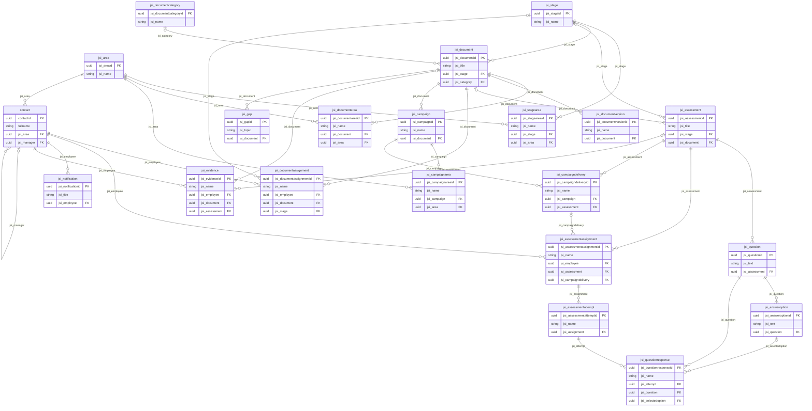

# Modelo Entidad–Relación — Onboarding and Micro-learning

Generado a partir de `schema.mjs`. Prefijo de publisher: `jsi_`. Solución: **Onboarding and Micro-learning**.

## Cómo leer este documento

- **ID (PK):** toda tabla de Dataverse tiene una clave primaria GUID llamada `<nombre_lógico>id` (ej. `jsi_areaid`).
- **Columna principal:** el campo de texto "nombre" de la tabla (el que se muestra en listas y lookups).
- **Lookup (FK):** columna que guarda el GUID del registro padre. Su nombre lógico es el de la columna (ej. `jsi_stage`). En la Web API/Code App aparece como `_jsi_stage_value` al leer.
- **Relación:** cada lookup crea una relación 1:N cuyo nombre se indica en la columna "Relación".
- Las tablas `*Area` (StageArea, DocumentArea, CampaignArea) son **tablas puente** que implementan relaciones N:N.
- Los valores Choice empiezan en 100000000 y suben de 1 en 1.

## 1. Diagrama ER

> Leyenda: `||--o{` = el hijo **requiere** padre; `|o--o{` = el padre es **opcional**. El texto de cada línea es la columna FK en la tabla hija.

## 2. Resumen de tablas

| # | Tabla | Nombre lógico | ID (PK) | Columna principal |
|---|---|---|---|---|
| 1 | Area | `jsi_area` | `jsi_areaid` | `jsi_name` |
| 2 | Stage | `jsi_stage` | `jsi_stageid` | `jsi_name` |
| 3 | Stage Area | `jsi_stagearea` | `jsi_stageareaid` | `jsi_name` |
| 4 | Document Category | `jsi_documentcategory` | `jsi_documentcategoryid` | `jsi_name` |
| 5 | Document | `jsi_document` | `jsi_documentid` | `jsi_title` |
| 6 | Document Area | `jsi_documentarea` | `jsi_documentareaid` | `jsi_name` |
| 7 | Document Version | `jsi_documentversion` | `jsi_documentversionid` | `jsi_name` |
| 8 | Assessment | `jsi_assessment` | `jsi_assessmentid` | `jsi_title` |
| 9 | Question | `jsi_question` | `jsi_questionid` | `jsi_text` |
| 10 | Answer Option | `jsi_answeroption` | `jsi_answeroptionid` | `jsi_text` |
| 11 | Document Assignment | `jsi_documentassignment` | `jsi_documentassignmentid` | `jsi_name` |
| 12 | Assessment Assignment | `jsi_assessmentassignment` | `jsi_assessmentassignmentid` | `jsi_name` |
| 13 | Assessment Attempt | `jsi_assessmentattempt` | `jsi_assessmentattemptid` | `jsi_name` |
| 14 | Question Response | `jsi_questionresponse` | `jsi_questionresponseid` | `jsi_name` |
| 15 | Campaign | `jsi_campaign` | `jsi_campaignid` | `jsi_name` |
| 16 | Campaign Area | `jsi_campaignarea` | `jsi_campaignareaid` | `jsi_name` |
| 17 | Campaign Delivery | `jsi_campaigndelivery` | `jsi_campaigndeliveryid` | `jsi_name` |
| 18 | Notification | `jsi_notification` | `jsi_notificationid` | `jsi_title` |
| 19 | Evidence | `jsi_evidence` | `jsi_evidenceid` | `jsi_name` |
| 20 | Gap | `jsi_gap` | `jsi_gapid` | `jsi_topic` |
| 21 | Employee (tabla estándar Contact) | `contact` | `contactid` | `fullname` |

## 3. Todas las relaciones

| Tabla padre (1) | Tabla hija (N) | Columna FK en la hija | Nombre de la relación | FK obligatoria |
|---|---|---|---|---|
| `jsi_stage` | `jsi_stagearea` | `jsi_stage` | `jsi_stage_stagearea` | Sí |
| `jsi_area` | `jsi_stagearea` | `jsi_area` | `jsi_area_stagearea` | Sí |
| `jsi_stage` | `jsi_document` | `jsi_stage` | `jsi_stage_document` | Sí |
| `jsi_documentcategory` | `jsi_document` | `jsi_category` | `jsi_documentcategory_document` | No |
| `jsi_document` | `jsi_documentarea` | `jsi_document` | `jsi_document_documentarea` | Sí |
| `jsi_area` | `jsi_documentarea` | `jsi_area` | `jsi_area_documentarea` | Sí |
| `jsi_document` | `jsi_documentversion` | `jsi_document` | `jsi_document_documentversion` | Sí |
| `jsi_stage` | `jsi_assessment` | `jsi_stage` | `jsi_stage_assessment` | No |
| `jsi_document` | `jsi_assessment` | `jsi_document` | `jsi_document_assessment` | No |
| `jsi_assessment` | `jsi_question` | `jsi_assessment` | `jsi_assessment_question` | Sí |
| `jsi_question` | `jsi_answeroption` | `jsi_question` | `jsi_question_answeroption` | Sí |
| `contact` | `jsi_documentassignment` | `jsi_employee` | `jsi_contact_documentassignment` | Sí |
| `jsi_document` | `jsi_documentassignment` | `jsi_document` | `jsi_document_documentassignment` | Sí |
| `jsi_stage` | `jsi_documentassignment` | `jsi_stage` | `jsi_stage_documentassignment` | No |
| `contact` | `jsi_assessmentassignment` | `jsi_employee` | `jsi_contact_assessmentassignment` | Sí |
| `jsi_assessment` | `jsi_assessmentassignment` | `jsi_assessment` | `jsi_assessment_assessmentassignment` | Sí |
| `jsi_campaigndelivery` | `jsi_assessmentassignment` | `jsi_campaigndelivery` | `jsi_campaigndelivery_assessmentassignment` | No |
| `jsi_assessmentassignment` | `jsi_assessmentattempt` | `jsi_assignment` | `jsi_assessmentassignment_assessmentattempt` | Sí |
| `jsi_assessmentattempt` | `jsi_questionresponse` | `jsi_attempt` | `jsi_assessmentattempt_questionresponse` | Sí |
| `jsi_question` | `jsi_questionresponse` | `jsi_question` | `jsi_question_questionresponse` | Sí |
| `jsi_answeroption` | `jsi_questionresponse` | `jsi_selectedoption` | `jsi_answeroption_questionresponse` | No |
| `jsi_document` | `jsi_campaign` | `jsi_document` | `jsi_document_campaign` | Sí |
| `jsi_campaign` | `jsi_campaignarea` | `jsi_campaign` | `jsi_campaign_campaignarea` | Sí |
| `jsi_area` | `jsi_campaignarea` | `jsi_area` | `jsi_area_campaignarea` | Sí |
| `jsi_campaign` | `jsi_campaigndelivery` | `jsi_campaign` | `jsi_campaign_campaigndelivery` | Sí |
| `jsi_assessment` | `jsi_campaigndelivery` | `jsi_assessment` | `jsi_assessment_campaigndelivery` | Sí |
| `contact` | `jsi_notification` | `jsi_employee` | `jsi_contact_notification` | Sí |
| `contact` | `jsi_evidence` | `jsi_employee` | `jsi_contact_evidence` | Sí |
| `jsi_document` | `jsi_evidence` | `jsi_document` | `jsi_document_evidence` | No |
| `jsi_assessment` | `jsi_evidence` | `jsi_assessment` | `jsi_assessment_evidence` | No |
| `jsi_document` | `jsi_gap` | `jsi_document` | `jsi_document_gap` | Sí |
| `jsi_area` | `contact` | `jsi_area` | `jsi_area_contact` | Sí |
| `contact` | `contact` | `jsi_manager` | `jsi_contact_manager_contact` | No |

## 4. Detalle por tabla

### 4.1 Area — `jsi_area`

Business areas/departments of the organization.

- **Propiedad:** Por organización (OrganizationOwned)
- **ID (PK):** `jsi_areaid`
- **Columna principal:** `jsi_name` (Name)

| Columna (lógico) | Nombre visible | Tipo | Obligatoria | Detalle |
|---|---|---|---|---|
| `jsi_areaid` | ID | GUID (PK) | Auto | Clave primaria |
| `jsi_name` | Name | Texto (columna principal) | Auto |  |
| `jsi_code` | Code | Texto (1 línea) | Sí | máx. 10 car. |

**Tablas que dependen de esta (relaciones 1:N):**

- `jsi_stagearea` mediante la columna `jsi_area` (relación `jsi_area_stagearea`)
- `jsi_documentarea` mediante la columna `jsi_area` (relación `jsi_area_documentarea`)
- `jsi_campaignarea` mediante la columna `jsi_area` (relación `jsi_area_campaignarea`)
- `contact` mediante la columna `jsi_area` (relación `jsi_area_contact`)

### 4.2 Stage — `jsi_stage`

Onboarding program stage (Stage 1, Stage 2, Stage 3 per area).

- **Propiedad:** Por organización (OrganizationOwned)
- **ID (PK):** `jsi_stageid`
- **Columna principal:** `jsi_name` (Name)

| Columna (lógico) | Nombre visible | Tipo | Obligatoria | Detalle |
|---|---|---|---|---|
| `jsi_stageid` | ID | GUID (PK) | Auto | Clave primaria |
| `jsi_name` | Name | Texto (columna principal) | Auto |  |
| `jsi_order` | Order | Entero | Sí |  |
| `jsi_businessdaysdeadline` | Business Days Deadline | Entero | Recomendado |  |
| `jsi_scope` | Scope | Choice | Sí | 100000000=General, 100000001=AreaSpecific |

**Tablas que dependen de esta (relaciones 1:N):**

- `jsi_stagearea` mediante la columna `jsi_stage` (relación `jsi_stage_stagearea`)
- `jsi_document` mediante la columna `jsi_stage` (relación `jsi_stage_document`)
- `jsi_assessment` mediante la columna `jsi_stage` (relación `jsi_stage_assessment`)
- `jsi_documentassignment` mediante la columna `jsi_stage` (relación `jsi_stage_documentassignment`)

### 4.3 Stage Area — `jsi_stagearea`

Junction table: which Areas a Stage applies to.

- **Propiedad:** Por organización (OrganizationOwned)
- **ID (PK):** `jsi_stageareaid`
- **Columna principal:** `jsi_name` (Name) — autonumérica `STGA-{SEQNUM:5}`

| Columna (lógico) | Nombre visible | Tipo | Obligatoria | Detalle |
|---|---|---|---|---|
| `jsi_stageareaid` | ID | GUID (PK) | Auto | Clave primaria |
| `jsi_name` | Name | Texto (columna principal) | Auto | Autonumérica |
| `jsi_stage` | Stage | Lookup (FK) | Sí | → `jsi_stage` · relación `jsi_stage_stagearea` |
| `jsi_area` | Area | Lookup (FK) | Sí | → `jsi_area` · relación `jsi_area_stagearea` |

### 4.4 Document Category — `jsi_documentcategory`

High-level topic used to classify documents.

- **Propiedad:** Por organización (OrganizationOwned)
- **ID (PK):** `jsi_documentcategoryid`
- **Columna principal:** `jsi_name` (Name)

| Columna (lógico) | Nombre visible | Tipo | Obligatoria | Detalle |
|---|---|---|---|---|
| `jsi_documentcategoryid` | ID | GUID (PK) | Auto | Clave primaria |
| `jsi_name` | Name | Texto (columna principal) | Auto |  |

**Tablas que dependen de esta (relaciones 1:N):**

- `jsi_document` mediante la columna `jsi_category` (relación `jsi_documentcategory_document`)

### 4.5 Document — `jsi_document`

A policy/manual document that is part of the onboarding program.

- **Propiedad:** Por organización (OrganizationOwned)
- **ID (PK):** `jsi_documentid`
- **Columna principal:** `jsi_title` (Title)

| Columna (lógico) | Nombre visible | Tipo | Obligatoria | Detalle |
|---|---|---|---|---|
| `jsi_documentid` | ID | GUID (PK) | Auto | Clave primaria |
| `jsi_title` | Title | Texto (columna principal) | Auto |  |
| `jsi_code` | Code | Texto (1 línea) | Sí | máx. 30 car. |
| `jsi_version` | Version | Texto (1 línea) | Sí | máx. 10 car. |
| `jsi_stage` | Stage | Lookup (FK) | Sí | → `jsi_stage` · relación `jsi_stage_document` |
| `jsi_category` | Category | Lookup (FK) | No | → `jsi_documentcategory` · relación `jsi_documentcategory_document` |
| `jsi_criticality` | Criticality | Choice | Sí | 100000000=High, 100000001=Medium, 100000002=Low |
| `jsi_status` | Status | Choice | Sí | 100000000=Current, 100000001=Updated, 100000002=Draft |
| `jsi_mandatory` | Mandatory | Sí/No | No | Yes/No · por defecto: Sí |
| `jsi_pagecount` | Page Count | Entero | No |  |
| `jsi_readingminutes` | Reading Minutes | Entero | No |  |
| `jsi_updatedon` | Updated On | Fecha | No |  |
| `jsi_owningdepartment` | Owning Department | Texto (1 línea) | No | máx. 100 car. |
| `jsi_summary` | Summary | Texto multilínea | No |  |
| `jsi_file` | File | Archivo | No |  |

**Tablas que dependen de esta (relaciones 1:N):**

- `jsi_documentarea` mediante la columna `jsi_document` (relación `jsi_document_documentarea`)
- `jsi_documentversion` mediante la columna `jsi_document` (relación `jsi_document_documentversion`)
- `jsi_assessment` mediante la columna `jsi_document` (relación `jsi_document_assessment`)
- `jsi_documentassignment` mediante la columna `jsi_document` (relación `jsi_document_documentassignment`)
- `jsi_campaign` mediante la columna `jsi_document` (relación `jsi_document_campaign`)
- `jsi_evidence` mediante la columna `jsi_document` (relación `jsi_document_evidence`)
- `jsi_gap` mediante la columna `jsi_document` (relación `jsi_document_gap`)

### 4.6 Document Area — `jsi_documentarea`

Junction table: audience areas of a Document.

- **Propiedad:** Por organización (OrganizationOwned)
- **ID (PK):** `jsi_documentareaid`
- **Columna principal:** `jsi_name` (Name) — autonumérica `DOCA-{SEQNUM:5}`

| Columna (lógico) | Nombre visible | Tipo | Obligatoria | Detalle |
|---|---|---|---|---|
| `jsi_documentareaid` | ID | GUID (PK) | Auto | Clave primaria |
| `jsi_name` | Name | Texto (columna principal) | Auto | Autonumérica |
| `jsi_document` | Document | Lookup (FK) | Sí | → `jsi_document` · relación `jsi_document_documentarea` |
| `jsi_area` | Area | Lookup (FK) | Sí | → `jsi_area` · relación `jsi_area_documentarea` |

### 4.7 Document Version — `jsi_documentversion`

Version history of a Document.

- **Propiedad:** Por organización (OrganizationOwned)
- **ID (PK):** `jsi_documentversionid`
- **Columna principal:** `jsi_name` (Name)

| Columna (lógico) | Nombre visible | Tipo | Obligatoria | Detalle |
|---|---|---|---|---|
| `jsi_documentversionid` | ID | GUID (PK) | Auto | Clave primaria |
| `jsi_name` | Name | Texto (columna principal) | Auto |  |
| `jsi_document` | Document | Lookup (FK) | Sí | → `jsi_document` · relación `jsi_document_documentversion` |
| `jsi_version` | Version | Texto (1 línea) | Sí | máx. 10 car. |
| `jsi_releasedate` | Release Date | Fecha | No |  |
| `jsi_changelevel` | Change Level | Choice | Sí | 100000000=Major, 100000001=Minor |
| `jsi_changedetails` | Change Details | Texto multilínea | No |  |

### 4.8 Assessment — `jsi_assessment`

An assessment, usually one per Stage, optionally ad-hoc per Document.

- **Propiedad:** Por organización (OrganizationOwned)
- **ID (PK):** `jsi_assessmentid`
- **Columna principal:** `jsi_title` (Title)

| Columna (lógico) | Nombre visible | Tipo | Obligatoria | Detalle |
|---|---|---|---|---|
| `jsi_assessmentid` | ID | GUID (PK) | Auto | Clave primaria |
| `jsi_title` | Title | Texto (columna principal) | Auto |  |
| `jsi_stage` | Stage | Lookup (FK) | No | → `jsi_stage` · relación `jsi_stage_assessment` |
| `jsi_document` | Document | Lookup (FK) | No | → `jsi_document` · relación `jsi_document_assessment` |
| `jsi_origin` | Origin | Choice | Sí | 100000000=Stage, 100000001=DocumentUpdate, 100000002=Campaign, 100000003=Manual |
| `jsi_durationminutes` | Duration Minutes | Entero | No |  |
| `jsi_passingscore` | Passing Score | Entero | Sí |  |
| `jsi_maxattempts` | Max Attempts | Entero | Sí |  |
| `jsi_deadlinedays` | Deadline Days | Entero | No |  |
| `jsi_generatedby` | Generated By | Texto (1 línea) | No | máx. 100 car. |
| `jsi_date` | Date | Fecha | No |  |

**Tablas que dependen de esta (relaciones 1:N):**

- `jsi_question` mediante la columna `jsi_assessment` (relación `jsi_assessment_question`)
- `jsi_assessmentassignment` mediante la columna `jsi_assessment` (relación `jsi_assessment_assessmentassignment`)
- `jsi_campaigndelivery` mediante la columna `jsi_assessment` (relación `jsi_assessment_campaigndelivery`)
- `jsi_evidence` mediante la columna `jsi_assessment` (relación `jsi_assessment_evidence`)

### 4.9 Question — `jsi_question`

A question that belongs to an Assessment.

- **Propiedad:** Por organización (OrganizationOwned)
- **ID (PK):** `jsi_questionid`
- **Columna principal:** `jsi_text` (Text)

| Columna (lógico) | Nombre visible | Tipo | Obligatoria | Detalle |
|---|---|---|---|---|
| `jsi_questionid` | ID | GUID (PK) | Auto | Clave primaria |
| `jsi_text` | Text | Texto (columna principal) | Auto |  |
| `jsi_assessment` | Assessment | Lookup (FK) | Sí | → `jsi_assessment` · relación `jsi_assessment_question` |
| `jsi_explanation` | Explanation | Texto multilínea | No |  |
| `jsi_order` | Order | Entero | No |  |
| `jsi_active` | Active | Sí/No | No | Yes/No · por defecto: Sí |

**Tablas que dependen de esta (relaciones 1:N):**

- `jsi_answeroption` mediante la columna `jsi_question` (relación `jsi_question_answeroption`)
- `jsi_questionresponse` mediante la columna `jsi_question` (relación `jsi_question_questionresponse`)

### 4.10 Answer Option — `jsi_answeroption`

An answer option that belongs to a Question.

- **Propiedad:** Por organización (OrganizationOwned)
- **ID (PK):** `jsi_answeroptionid`
- **Columna principal:** `jsi_text` (Text)

| Columna (lógico) | Nombre visible | Tipo | Obligatoria | Detalle |
|---|---|---|---|---|
| `jsi_answeroptionid` | ID | GUID (PK) | Auto | Clave primaria |
| `jsi_text` | Text | Texto (columna principal) | Auto |  |
| `jsi_question` | Question | Lookup (FK) | Sí | → `jsi_question` · relación `jsi_question_answeroption` |
| `jsi_order` | Order | Entero | No |  |
| `jsi_iscorrect` | Is Correct | Sí/No | No | Yes/No · por defecto: No |

**Tablas que dependen de esta (relaciones 1:N):**

- `jsi_questionresponse` mediante la columna `jsi_selectedoption` (relación `jsi_answeroption_questionresponse`)

### 4.11 Document Assignment — `jsi_documentassignment`

A document assigned to one employee, with its reading status.

- **Propiedad:** Por usuario (UserOwned)
- **ID (PK):** `jsi_documentassignmentid`
- **Columna principal:** `jsi_name` (Name) — autonumérica `DOCA-{SEQNUM:6}`

| Columna (lógico) | Nombre visible | Tipo | Obligatoria | Detalle |
|---|---|---|---|---|
| `jsi_documentassignmentid` | ID | GUID (PK) | Auto | Clave primaria |
| `jsi_name` | Name | Texto (columna principal) | Auto | Autonumérica |
| `jsi_employee` | Employee | Lookup (FK) | Sí | → `contact` · relación `jsi_contact_documentassignment` |
| `jsi_document` | Document | Lookup (FK) | Sí | → `jsi_document` · relación `jsi_document_documentassignment` |
| `jsi_stage` | Stage | Lookup (FK) | No | → `jsi_stage` · relación `jsi_stage_documentassignment` |
| `jsi_status` | Status | Choice | Sí | 100000000=Pending, 100000001=Read |
| `jsi_confirmedon` | Confirmed On | Fecha y hora | No |  |
| `jsi_duedate` | Due Date | Fecha | No |  |
| `jsi_source` | Source | Texto (1 línea) | No | máx. 150 car. |

### 4.12 Assessment Assignment — `jsi_assessmentassignment`

An assessment assigned to one employee, with its progress.

- **Propiedad:** Por usuario (UserOwned)
- **ID (PK):** `jsi_assessmentassignmentid`
- **Columna principal:** `jsi_name` (Name) — autonumérica `ASGN-{SEQNUM:6}`

| Columna (lógico) | Nombre visible | Tipo | Obligatoria | Detalle |
|---|---|---|---|---|
| `jsi_assessmentassignmentid` | ID | GUID (PK) | Auto | Clave primaria |
| `jsi_name` | Name | Texto (columna principal) | Auto | Autonumérica |
| `jsi_employee` | Employee | Lookup (FK) | Sí | → `contact` · relación `jsi_contact_assessmentassignment` |
| `jsi_assessment` | Assessment | Lookup (FK) | Sí | → `jsi_assessment` · relación `jsi_assessment_assessmentassignment` |
| `jsi_campaigndelivery` | Campaign Delivery | Lookup (FK) | No | → `jsi_campaigndelivery` · relación `jsi_campaigndelivery_assessmentassignment` |
| `jsi_status` | Status | Choice | Sí | 100000000=Locked, 100000001=Pending, 100000002=Passed, 100000003=Failed |
| `jsi_score` | Score | Entero | No |  |
| `jsi_attemptsused` | Attempts Used | Entero | No |  |
| `jsi_duedate` | Due Date | Fecha | No |  |
| `jsi_resolvedon` | Resolved On | Fecha y hora | No |  |

**Tablas que dependen de esta (relaciones 1:N):**

- `jsi_assessmentattempt` mediante la columna `jsi_assignment` (relación `jsi_assessmentassignment_assessmentattempt`)

### 4.13 Assessment Attempt — `jsi_assessmentattempt`

One attempt taken against an Assessment Assignment.

- **Propiedad:** Por usuario (UserOwned)
- **ID (PK):** `jsi_assessmentattemptid`
- **Columna principal:** `jsi_name` (Name) — autonumérica `ATPT-{SEQNUM:6}`

| Columna (lógico) | Nombre visible | Tipo | Obligatoria | Detalle |
|---|---|---|---|---|
| `jsi_assessmentattemptid` | ID | GUID (PK) | Auto | Clave primaria |
| `jsi_name` | Name | Texto (columna principal) | Auto | Autonumérica |
| `jsi_assignment` | Assignment | Lookup (FK) | Sí | → `jsi_assessmentassignment` · relación `jsi_assessmentassignment_assessmentattempt` |
| `jsi_attemptnumber` | Attempt Number | Entero | Sí |  |
| `jsi_score` | Score | Entero | No |  |
| `jsi_takenon` | Taken On | Fecha y hora | No |  |
| `jsi_durationseconds` | Duration Seconds | Entero | No |  |

**Tablas que dependen de esta (relaciones 1:N):**

- `jsi_questionresponse` mediante la columna `jsi_attempt` (relación `jsi_assessmentattempt_questionresponse`)

### 4.14 Question Response — `jsi_questionresponse`

The answer an employee picked for one Question within an Attempt.

- **Propiedad:** Por usuario (UserOwned)
- **ID (PK):** `jsi_questionresponseid`
- **Columna principal:** `jsi_name` (Name) — autonumérica `RESP-{SEQNUM:6}`

| Columna (lógico) | Nombre visible | Tipo | Obligatoria | Detalle |
|---|---|---|---|---|
| `jsi_questionresponseid` | ID | GUID (PK) | Auto | Clave primaria |
| `jsi_name` | Name | Texto (columna principal) | Auto | Autonumérica |
| `jsi_attempt` | Attempt | Lookup (FK) | Sí | → `jsi_assessmentattempt` · relación `jsi_assessmentattempt_questionresponse` |
| `jsi_question` | Question | Lookup (FK) | Sí | → `jsi_question` · relación `jsi_question_questionresponse` |
| `jsi_selectedoption` | Selected Option | Lookup (FK) | No | → `jsi_answeroption` · relación `jsi_answeroption_questionresponse` |
| `jsi_iscorrect` | Is Correct | Sí/No | No | Yes/No · por defecto: No |

### 4.15 Campaign — `jsi_campaign`

A recurring micro-learning reinforcement campaign.

- **Propiedad:** Por usuario (UserOwned)
- **ID (PK):** `jsi_campaignid`
- **Columna principal:** `jsi_name` (Name)

| Columna (lógico) | Nombre visible | Tipo | Obligatoria | Detalle |
|---|---|---|---|---|
| `jsi_campaignid` | ID | GUID (PK) | Auto | Clave primaria |
| `jsi_name` | Name | Texto (columna principal) | Auto |  |
| `jsi_document` | Document | Lookup (FK) | Sí | → `jsi_document` · relación `jsi_document_campaign` |
| `jsi_focus` | Focus | Choice | Sí | 100000000=GapReinforcement, 100000001=Awareness, 100000002=Wellbeing, 100000003=Manual |
| `jsi_frequency` | Frequency | Choice | Sí | 100000000=Daily, 100000001=Weekly, 100000002=Biweekly, 100000003=Monthly |
| `jsi_assessmentcount` | Assessment Count | Entero | Sí |  |
| `jsi_status` | Status | Choice | Sí | 100000000=Draft, 100000001=Active, 100000002=Paused, 100000003=Finished |
| `jsi_aisuggested` | AI Suggested | Sí/No | No | Yes/No · por defecto: No |
| `jsi_nextdate` | Next Date | Fecha | No |  |

**Tablas que dependen de esta (relaciones 1:N):**

- `jsi_campaignarea` mediante la columna `jsi_campaign` (relación `jsi_campaign_campaignarea`)
- `jsi_campaigndelivery` mediante la columna `jsi_campaign` (relación `jsi_campaign_campaigndelivery`)

### 4.16 Campaign Area — `jsi_campaignarea`

Junction table: audience areas of a Campaign.

- **Propiedad:** Por organización (OrganizationOwned)
- **ID (PK):** `jsi_campaignareaid`
- **Columna principal:** `jsi_name` (Name) — autonumérica `CPGA-{SEQNUM:5}`

| Columna (lógico) | Nombre visible | Tipo | Obligatoria | Detalle |
|---|---|---|---|---|
| `jsi_campaignareaid` | ID | GUID (PK) | Auto | Clave primaria |
| `jsi_name` | Name | Texto (columna principal) | Auto | Autonumérica |
| `jsi_campaign` | Campaign | Lookup (FK) | Sí | → `jsi_campaign` · relación `jsi_campaign_campaignarea` |
| `jsi_area` | Area | Lookup (FK) | Sí | → `jsi_area` · relación `jsi_area_campaignarea` |

### 4.17 Campaign Delivery — `jsi_campaigndelivery`

One scheduled send of a Campaign (one Assessment on one date).

- **Propiedad:** Por usuario (UserOwned)
- **ID (PK):** `jsi_campaigndeliveryid`
- **Columna principal:** `jsi_name` (Name) — autonumérica `DLVR-{SEQNUM:6}`

| Columna (lógico) | Nombre visible | Tipo | Obligatoria | Detalle |
|---|---|---|---|---|
| `jsi_campaigndeliveryid` | ID | GUID (PK) | Auto | Clave primaria |
| `jsi_name` | Name | Texto (columna principal) | Auto | Autonumérica |
| `jsi_campaign` | Campaign | Lookup (FK) | Sí | → `jsi_campaign` · relación `jsi_campaign_campaigndelivery` |
| `jsi_assessment` | Assessment | Lookup (FK) | Sí | → `jsi_assessment` · relación `jsi_assessment_campaigndelivery` |
| `jsi_sequencenumber` | Sequence Number | Entero | Sí |  |
| `jsi_senddate` | Send Date | Fecha | No |  |
| `jsi_status` | Status | Choice | Sí | 100000000=Scheduled, 100000001=Sent |

**Tablas que dependen de esta (relaciones 1:N):**

- `jsi_assessmentassignment` mediante la columna `jsi_campaigndelivery` (relación `jsi_campaigndelivery_assessmentassignment`)

### 4.18 Notification — `jsi_notification`

A notification sent to an employee.

- **Propiedad:** Por usuario (UserOwned)
- **ID (PK):** `jsi_notificationid`
- **Columna principal:** `jsi_title` (Title)

| Columna (lógico) | Nombre visible | Tipo | Obligatoria | Detalle |
|---|---|---|---|---|
| `jsi_notificationid` | ID | GUID (PK) | Auto | Clave primaria |
| `jsi_title` | Title | Texto (columna principal) | Auto |  |
| `jsi_employee` | Employee | Lookup (FK) | Sí | → `contact` · relación `jsi_contact_notification` |
| `jsi_type` | Type | Choice | Sí | 100000000=Reminder, 100000001=DocumentUpdate, 100000002=Assessment, 100000003=Campaign, 100000004=Welcome |
| `jsi_details` | Details | Texto multilínea | No |  |
| `jsi_date` | Date | Fecha y hora | No |  |
| `jsi_status` | Status | Choice | Sí | 100000000=Sent, 100000001=Read |

### 4.19 Evidence — `jsi_evidence`

Audit trail of a reading confirmation or assessment result.

- **Propiedad:** Por usuario (UserOwned)
- **ID (PK):** `jsi_evidenceid`
- **Columna principal:** `jsi_name` (Name) — autonumérica `EVID-{SEQNUM:6}`

| Columna (lógico) | Nombre visible | Tipo | Obligatoria | Detalle |
|---|---|---|---|---|
| `jsi_evidenceid` | ID | GUID (PK) | Auto | Clave primaria |
| `jsi_name` | Name | Texto (columna principal) | Auto | Autonumérica |
| `jsi_employee` | Employee | Lookup (FK) | Sí | → `contact` · relación `jsi_contact_evidence` |
| `jsi_document` | Document | Lookup (FK) | No | → `jsi_document` · relación `jsi_document_evidence` |
| `jsi_assessment` | Assessment | Lookup (FK) | No | → `jsi_assessment` · relación `jsi_assessment_evidence` |
| `jsi_version` | Version | Texto (1 línea) | No | máx. 10 car. |
| `jsi_date` | Date | Fecha y hora | No |  |
| `jsi_hash` | Hash | Texto (1 línea) | No | máx. 128 car. |

### 4.20 Gap — `jsi_gap`

Periodic snapshot of a comprehension gap on a Document topic.

- **Propiedad:** Por organización (OrganizationOwned)
- **ID (PK):** `jsi_gapid`
- **Columna principal:** `jsi_topic` (Topic)

| Columna (lógico) | Nombre visible | Tipo | Obligatoria | Detalle |
|---|---|---|---|---|
| `jsi_gapid` | ID | GUID (PK) | Auto | Clave primaria |
| `jsi_topic` | Topic | Texto (columna principal) | Auto |  |
| `jsi_document` | Document | Lookup (FK) | Sí | → `jsi_document` · relación `jsi_document_gap` |
| `jsi_errorpercentage` | Error Percentage | Decimal | No | precisión 2 |
| `jsi_affectedcount` | Affected Count | Entero | No |  |
| `jsi_trend` | Trend | Choice | Sí | 100000000=Rising, 100000001=Stable, 100000002=Falling |
| `jsi_cutoffdate` | Cutoff Date | Fecha | No |  |

### 4.21 Employee (tabla estándar Contact) — `contact`

Tabla estándar de Dataverse usada como Employee. Solo se listan las columnas agregadas por este proyecto (jsi_).

- **ID (PK):** `contactid`
- **Columna principal:** `fullname` (Full Name)

| Columna (lógico) | Nombre visible | Tipo | Obligatoria | Detalle |
|---|---|---|---|---|
| `contactid` | ID | GUID (PK) | Auto | Clave primaria |
| `fullname` | Full Name | Texto (columna principal) | Auto |  |
| `jsi_jobtitle` | Job Title | Texto (1 línea) | No | máx. 100 car. |
| `jsi_area` | Area | Lookup (FK) | Sí | → `jsi_area` · relación `jsi_area_contact` |
| `jsi_manager` | Manager | Lookup (FK) | No | → `contact` · relación `jsi_contact_manager_contact` |
| `jsi_hiredate` | Hire Date | Fecha | No |  |
| `jsi_onboardingstatus` | Onboarding Status | Choice | Sí | 100000000=Active, 100000001=PendingValidation |
| `jsi_progressstatus` | Progress Status | Choice | Sí | 100000000=NotStarted, 100000001=InProgress, 100000002=Overdue, 100000003=Completed |
| `jsi_risklevel` | Risk Level | Choice | Sí | 100000000=Low, 100000001=Medium, 100000002=High |

**Tablas que dependen de esta (relaciones 1:N):**

- `jsi_documentassignment` mediante la columna `jsi_employee` (relación `jsi_contact_documentassignment`)
- `jsi_assessmentassignment` mediante la columna `jsi_employee` (relación `jsi_contact_assessmentassignment`)
- `jsi_notification` mediante la columna `jsi_employee` (relación `jsi_contact_notification`)
- `jsi_evidence` mediante la columna `jsi_employee` (relación `jsi_contact_evidence`)
- `contact` mediante la columna `jsi_manager` (relación `jsi_contact_manager_contact`)
